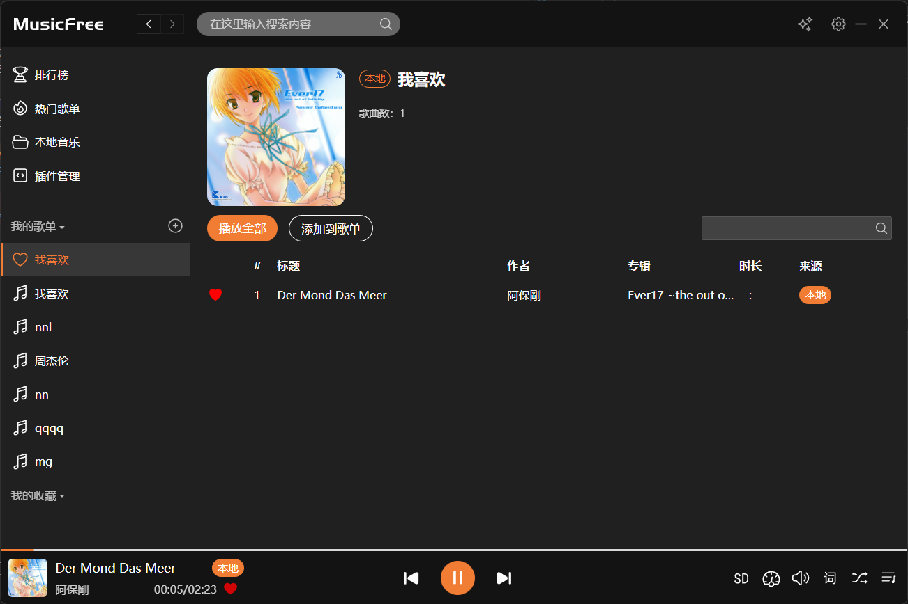
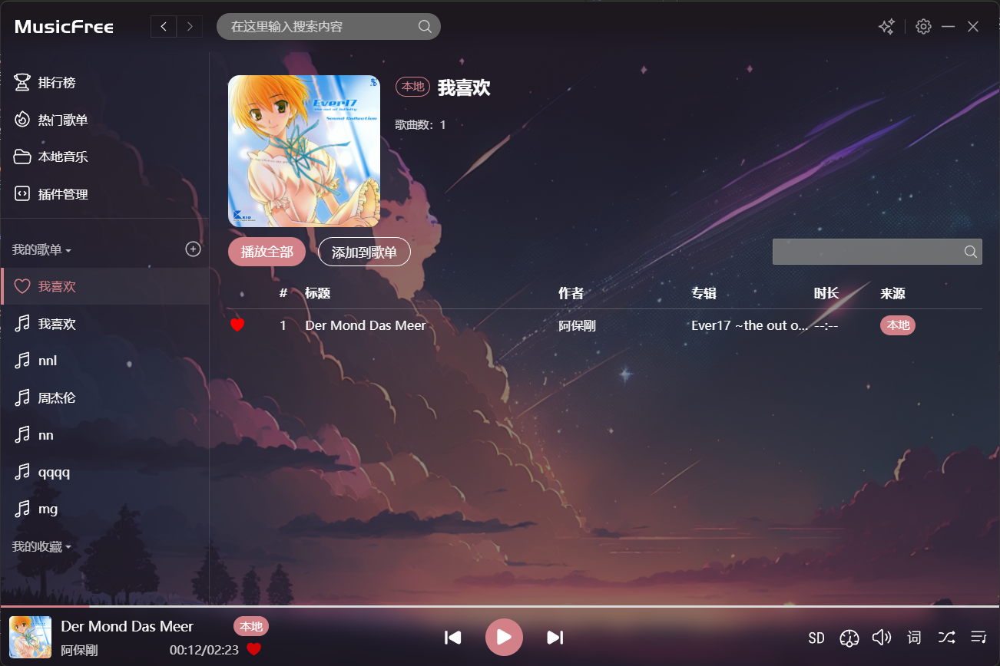
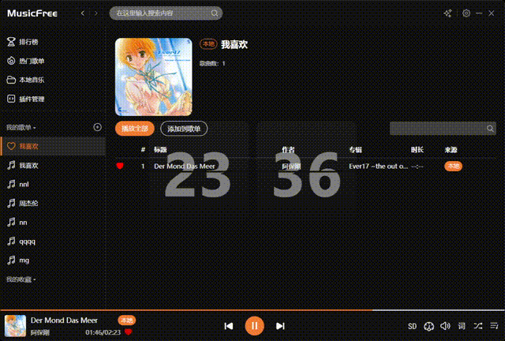
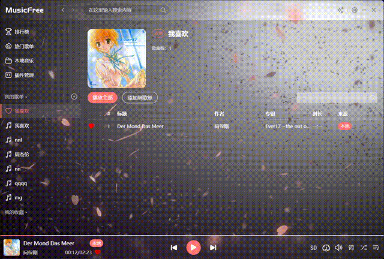
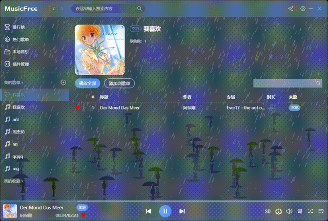
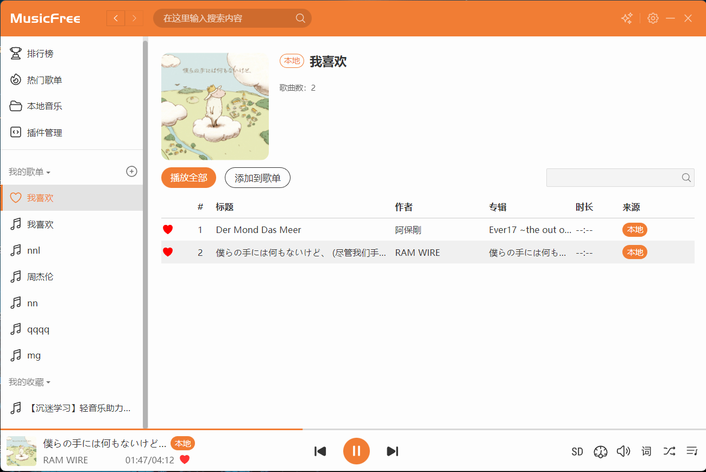
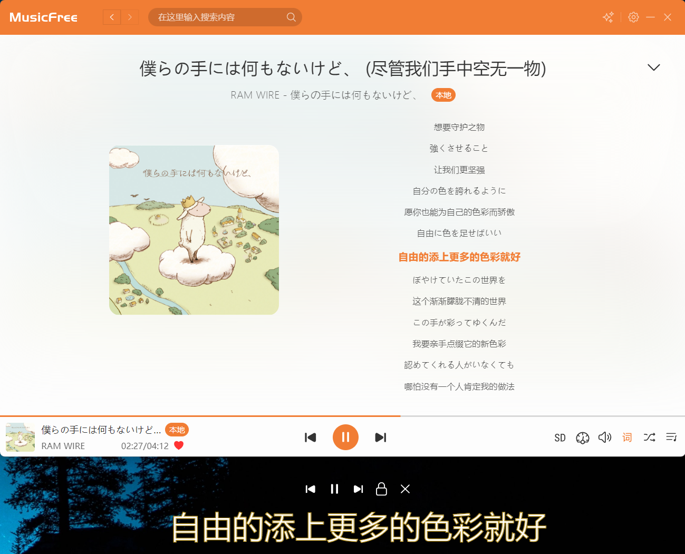

# MusicFree 桌面版

## 本项目基于 GPL 3.0 协议开源，不禁止二次分发，但使用代码时请遵守如下规则：

1. 二次分发版必须同样遵循 GPL 3.0 协议，**开源且免费**
2. **合法合规使用代码，禁止用于商业用途; 修改后的软件造成的任何问题由使用此代码的开发者承担**
3. 打包、二次分发 **请保留代码出处**：https://github.com/maotoumao/MusicFree
4. 如果使用此代码的开发者不同意以上三条，则视为 **二次分发版遵守 CC0 协议**
5. 如果开源协议变更，将在此 Github 仓库更新，不另行通知

---

## 简介

一个插件化、定制化、无广告的免费音乐播放器。
> 当前测试版支持 windows 和 macos x64；macos m1/m2 和 linux 可自行打包。


### 下载地址

[蓝奏云下载地址](https://wwzb.lanzoue.com/b042da1xe)

## 特性

- 插件化：本软件仅仅是一个播放器，本身**并不集成**任何平台的任何音源，所有的搜索、播放、歌单导入等功能全部基于**插件**。这也就意味着，**只要可以在互联网上搜索到的音源，只要有对应的插件，你都可以使用本软件进行搜索、播放等功能。** 关于插件的详细说明请参考 [安卓版 Readme 的插件部分](https://github.com/maotoumao/MusicFree#%E6%8F%92%E4%BB%B6)。

- 插件支持的功能：搜索（音乐、专辑、作者、歌单）、播放、查看专辑、查看作者详细信息、导入单曲、导入歌单、获取歌词等。

- 定制化：本软件可以通过主题包定义软件外观及背景，详见下方主题包一节。

- 无广告：基于 GPL3.0 协议开源，将会保持免费。

- 隐私：软件所有数据存储在本地，本软件不会上传你的个人信息。

## 插件

插件协议和安卓版完全相同。

[示例插件仓库](https://github.com/maotoumao/MusicFreePlugins)，你可以根据[插件开发文档](http://musicfree.upup.fun/docs/tutorial-plugin/intro/) 开发适配于任意音源的插件。

## 主题包

主题包是一个文件夹，文件夹内必须包含两个文件：

```bash
index.css
config.json
```

### index.css

index.css 中可以覆盖界面中的任何样式。你可以通过定义 css 变量来完成大部分颜色的替换，也可以查看源代码，根据类名等覆盖样式。

支持的 css 变量如下：

``` css
:root {
  --primaryColor: #f17d34; // 主色调
  --backgroundColor: #fdfdfd; // 背景色
  --dividerColor: rgba(0, 0, 0, 0.1); // 分割线颜色
  --listHoverColor: rgba(0, 0, 0, 0.05); // 列表悬浮颜色
  --listActiveColor: rgba(0, 0, 0, 0.1); // 列表选中颜色
  --textColor: #333333; // 主文本颜色
  --maskColor: rgba(51, 51, 51, 0.2); // 遮罩层颜色
  --shadowColor: rgba(0, 0, 0, 0.2); // 对话框等阴影颜色
  /** --shadow:  // shadow属性 */
  --placeholderColor: #f4f4f4; // 输入区背景颜色
  --successColor: #08A34C; // 成功颜色
  --dangerColor: #FC5F5F; // 危险颜色
  --infoColor: #0A95C8; // 通知颜色
  --headerTextColor: white; // 顶部文本颜色
}
```

具体的例子可以参考 [暗黑模式](https://github.com/maotoumao/MusicFreeThemePacks/blob/master/darkmode/index.css)

除了通过 css 定义常规样式外，也可以通过在 config.json 中定义 iframes 字段，用来把任意的 html 文件作为软件背景，这样可以实现一些单纯用 css 无法实现的效果。

### config.json

config.json 是一个配置文件。

```json
{
    "name": "主题包的名称",
    "preview": "#000000", // 预览图，支持颜色或图片；
    "description": "描述文本",
    "iframes": {
        "app": "http://musicfree.upup.fun", // 整个软件的背景
        "header": "", // 头部区域的背景
        "body": "", // 侧边栏+主页面区域的背景
        "side-bar": "", // 侧边栏区域的背景
        "page": "", // 主页面区域的背景
        "music-bar": "", // 底部音乐栏的背景

    }
}
```

如果需要指向本地的图片，可以通过 ```@/``` 表示主题包的路径；preview、iframes、以及 iframes 指向的 html 文件都会把 ```@/``` 替换为 ```主题包路径```。详情可参考 [樱花主题](https://github.com/maotoumao/MusicFreeThemePacks/tree/master/sakura)

### 主题包示例

示例仓库：https://github.com/maotoumao/MusicFreeThemePacks

几个主题包效果截图：

#### 暗黑模式
[源代码](https://github.com/maotoumao/MusicFreeThemePacks/tree/master/darkmode)



#### 背景图片
[源代码](https://github.com/maotoumao/MusicFreeThemePacks/tree/master/night-star)



#### fliqlo
[源代码](https://github.com/maotoumao/MusicFreeThemePacks/tree/master/fliqlo)



#### 樱花
[源代码](https://github.com/maotoumao/MusicFreeThemePacks/tree/master/sakura)



#### 雨季
[源代码](https://github.com/maotoumao/MusicFreeThemePacks/tree/master/rainy-season)



## 启动项目

下载仓库代码之后，在根目录下执行：

```bash
npm install
npm start
```

## 支持这个项目

如果你喜欢这个项目，或者希望我可以持续维护下去，你可以通过以下任何一种方式支持我;)

1. Star 这个项目，分享给你身边的人；
2. 关注公众号【一只猫头猫】获取最新信息；


## 截图






